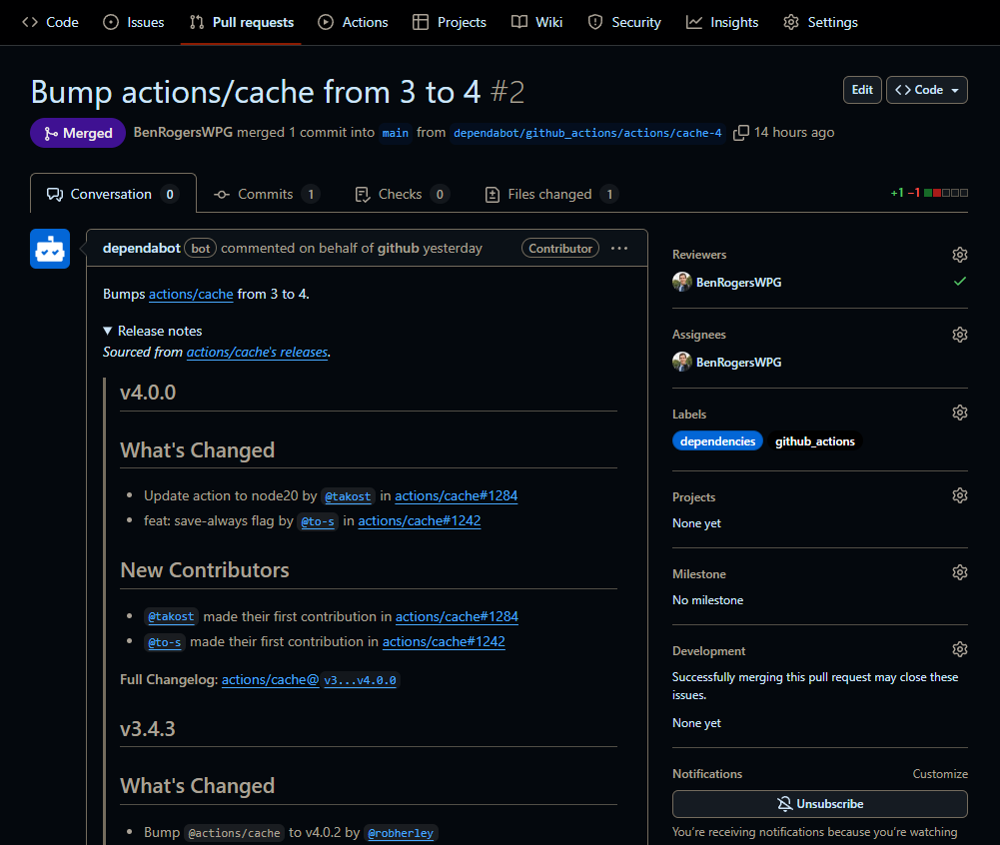

# GitHub Actions Update Notifier

This project will *automatically* notify you in the form of a pull request when your favorite GitHub Actions are updated.

## How To Use
1. Fork this repository.
2. Update [notifier.yml](.github/workflows/notifier.yml) with the actions you want to monitor. You can find the list of actions in the file, and I have included instructions in it to help you there, too.
3. Save and commit
4. Set up and run dependabot, specifically targeting GitHub Actions.
   1. Go to your forked repository on GitHub.
   2. Click on the "Settings" tab.
   3. On the left sidebar, click on "Code Security".
   4. Under the Dependabot section, enable the very last entry, "Dependabot on Actions runners".
   5. Enable other dependabot options if you want to be notified on other aspects of your repository too. Also important if you want to be notified on security vulnerabilities.
5. To be notified when updates are available (when the monitor creates new pull requests), update the dependabot file, and replace your username with the one I have set.
   1. Go to the [.github/dependabot.yml](.github/dependabot.yml) file in your forked repository.
   2. Update the `assignees` section with your username.
   3. Save and commit.

## What It Does
When the above is all set up, you will receive a pull request when any of the actions you are monitoring are updated. The pull request will contain the following information:
- The name of the action that was updated.
- The version that was updated to.
- The link to the action's repository.
- The full action changelog between the version you are on and the version you are being updated to.
- The release notes of the version since your last update, including what has changed, what has been fixed, and what has been added.
- A full list of all the commits that have been made since your last update.
- A compatibility percentage with your current version.
- A list of all the files that have been changed in the action's repository since your last update.

*This project is inspired by Mickey Gousset's [GitHub Actions idea](https://github.com/devopselvis/dependabot-version-updates-example4).*
